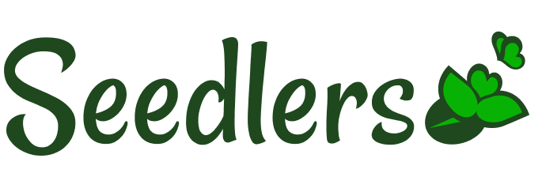

# 🌱 Seedlers — Community Gardening App

 

                                                             
  

  

 

## 🌿 Overview

Seedlers is a UX concept project designed to connect plant enthusiasts through plant sharing, gardening activities, tips, and community interaction.

The project explores how digital communities can support well-being, sustainability, and social connection through shared interest in plants and urban gardening.

 

## 🧠 UX Process

The project included:

- user surveys and interviews
- empathy mapping
- pain-point analysis
- feature prioritization
- user flows
- personas
- wireframes
- low-fidelity prototyping

 

## 🪴 Main Features Explored

- Plant sharing (“Seedlets”)
- Plant-sitting support
- Community interaction
- Gardening events and tips
- User onboarding and profile flows

 

## 📌 Selected Materials

### 🎨 Low-Fidelity Prototype
https://www.figma.com/file/9uJ68rIGDXhyfjyaZo3mL1/Seedlers?node-id=0%3A1

 

### 👥 Personas
https://github.com/pradoprojects/Seedlers/blob/main/PersonasSeedlers.pdf

 

### 🧩 Miro Board
https://miro.com/app/board/o9J_ltb4wlM=/?share_link_id=487311014111

 

### 📋 Research Survey
https://docs.google.com/forms/d/e/1FAIpQLSc06PteuH4msio_GrgMWsSAKQ4AUceDDeViGrUwp0ENCsGckw/viewform

 

                                                             
  

  

 

## 🚧 Development Highlights

- Conducted surveys and interviews with potential users
- Organized insights through affinity mapping and empathy maps
- Defined pain points and feature priorities
- Built onboarding, sharing, and plant-sitting flows
- Designed wireframes and low-fidelity prototypes
- Iterated logo and landing page concepts

